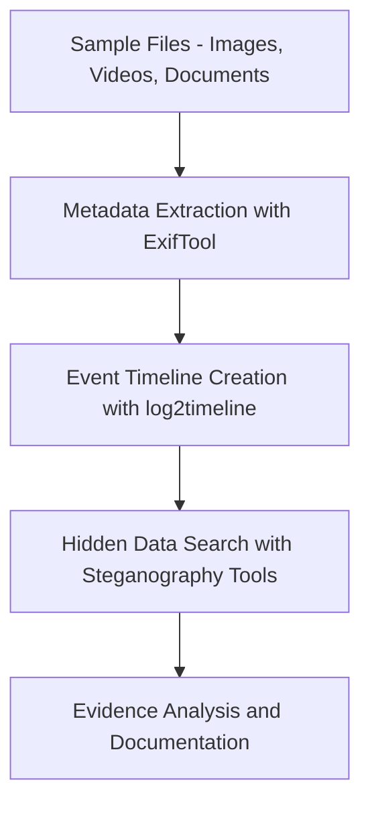

# Metadata-Extraction-using-ExifTool-log2timeline-and-Hidden-Data-Search-using-Steganography-Tools
## AIM:
To extract metadata, perform timeline analysis, and search for hidden data using forensic tools like ExifTool, log2timeline, and steganography detection tools.
## REQUIREMENTS
- **Operating System:** Kali Linux (preferred) or any Linux distro with forensic tools
- **Tools:**
     -  ExifTool – For metadata extraction
     -  plaso/log2timeline – For timeline analysis
- **Steganography tools:** steghide, zsteg, binwalk
- **Test Data:** Image, video, and document files (some with embedded hidden data)
## ARCHITECTURE DIAGRAM

## DESIGN STEPS:
### Step 1:
Use exiftool to extract metadata from files such as images, documents, and videos.

### Step 2:
Use log2timeline and plaso to create and analyze event timelines from system logs and file metadata.

### Step 3:
Apply steganography detection tools like steghide, zsteg, or binwalk to uncover hidden data in media files.

## PROGRAM:
| Step | Action                  | Tool                 | Output                           |
| ---- | ----------------------- | -------------------- | -------------------------------- |
| 1    | Extract file metadata   | ExifTool             | Metadata fields, GPS, timestamps |
| 2    | Generate event timeline | log2timeline / plaso | CSV/HTML timeline                |
| 3    | Search for hidden data  | steghide / binwalk   | Extracted hidden files           |
| 4    | Document findings       | Manual report        | Investigation record             |


## OUTPUT:
### A. Using ExifTool – for file metadata
- **Install:**
```bash
sudo apt update
sudo apt install exiftool -y
```


- **Extract metadata from a file:**
```bash
exiftool image.jpg
```


- **Batch process a folder:**
  
```bash
exiftool -r /path/to/folder
```


- **Useful flags:**
  
- ```-G: Show metadata group```


- ```-time:all: Show only timestamps```


- ```-GPSLatitude -GPSLongitude: Extract GPS data```


### install log2timeline
```
sudo apt install plaso -y
```


```
sudo apt install steghide -y
```


- **Embed data**
```
steghide embed -cf /home/kali/Downloads/wallpaper.jpg -ef /home/kali/Downloads/secret.txt
```


- **Extract hidden data:**
```
steghide extract -sf hidden.jpg
```


### Using binwalk – for file analysis
```bash
sudo apt install binwalk -y
binwalk suspicious.jpg
```


```bash
binwalk /home/kali/Downloads/wallpaper.jpg
```


## RESULT:
Metadata was successfully extracted, timeline analysis was completed, and hidden data was identified using steganography tools.
